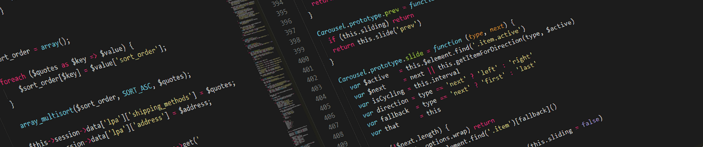

[Français 🇫🇷](https://github.com/Choucroute-melba/Choucroute-melba/blob/master/README-Fr.md)

## Hi 👋

I am Vivien, a little Frenchman with a passion for development in particular and IT in general.

- 🔭 I’m currently working on anything I can get my hands on
- 🌱 I’m currently learning anything I can get my hands on
- 👯 I’m looking to collaborate on anything I can get my hands on
- 👋 I'm interesting in Android, electronics, Web development, Qt, ...

It's been three years since I started programming, first in electronics, then in the Web and finally on mobile with Android.

In order to combine business with pleasure and because it was time for me to start real projects, I offer my services as a web / mobile developer.

Consequently... :

### ⚡ I give life to your projects !

- **🌐 Web developement**

  Need a website for your business, your organization, ... ? I'm here for you !

  _**Technologies :**_
  - HTML / CSS (of course)
  - [React.js](https://reactjs.org/)
  - [Next.js](https://nextjs.org/)
- **🤖 Discord bots**

  I create Discord bots to enrich your server, animate your community, and more...
- **📱 Mobile ─ Android**

  Reach millions of people with a mobile application !

  _**Technologies :**_
  - [Android Framework](https://developer.android.com/) / [JetPack](https://developer.android.com/jetpack)
  - [React native](https://reactnative.dev/)

_─ 📧 vivien@netc.fr  · 📍 Angers, France ─_

<!--
**Choucroute-melba/Choucroute-melba** is a ✨ _special_ ✨ repository because its `README.md` (this file) appears on your GitHub profile.

Here are some ideas to get you started:

- 🔭 I’m currently working on ...
- 🌱 I’m currently learning ...
- 👯 I’m looking to collaborate on ...
- 🤔 I’m looking for help with ...
- 💬 Ask me about ...
- 📫 How to reach me: ...
- 😄 Pronouns: ...
- ⚡ Fun fact: ...
-->
